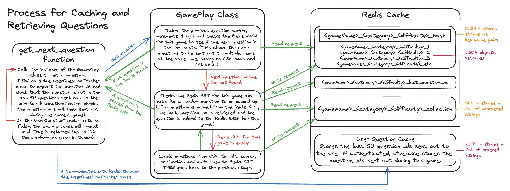

# GamesZero

https://games0-by-shakey0.onrender.com/

## Introduction

Welcome to GamesZero! This is a project I began about a month after finishing the Makers Academy Software Engineering Bootcamp. I took up this project for a number of reasons. Let's dive into it.<br><br>
Firstly, I wanted to get more experience with APIs, and this project has been fantastic for that. I've written two scripts ([create_CSV_contents_from_API.py](https://github.com/shakey0/Games0Project/blob/main/create_CSV_contents_from_API.py) and [create_trivia_CSV_from_API.py](https://github.com/shakey0/Games0Project/blob/main/create_trivia_CSV_from_API.py)) which I have used to retrieve and sort hundreds of quiz questions from various different API sources. I also have one game in this web app (Trivia - Multiple Choice) that takes the questions from the API while the app is running ([see here](https://github.com/shakey0/Games0Project/blob/main/Games0App/classes/game_play.py#L25-L58)).<br><br>
Secondly, I wanted to learn more about caching with Redis. I have used Redis in this webapp for extensive caching of the game data when a user is doing a quiz (see [main.py](https://github.com/shakey0/Games0Project/blob/main/Games0App/views/main.py) and [main_functions.py](https://github.com/shakey0/Games0Project/blob/main/Games0App/views/main_functions.py)). This is a brilliant way to robustly store the game data on the backend and eliminate any potentiality for it to be manipulated. I have also used Redis to cache the questions sent out to users, to avoid the same question being sent in the same game or, if the user is logged in, to avoid the same question being sent within the next 5 games (see [user_question_tracker.py](https://github.com/shakey0/Games0Project/blob/main/Games0App/classes/user_question_tracker.py)). I have used it to store bulks of questions recieved from an API and CSV files too ([see here](https://github.com/shakey0/Games0Project/blob/main/Games0App/classes/game_play.py#L113-L167)).<br><br>
Thirdly, I wanted to gain more experience around creating secure authentication routes (see [auth.py](https://github.com/shakey0/Games0Project/blob/main/Games0App/views/auth.py#L133-L516)). Again, I've used Redis here in the AuthTokenManager class to cache tokens for various auth processes (see [auth_token_manager.py](https://github.com/shakey0/Games0Project/blob/main/Games0App/classes/auth_token_manager.py)).<br><br>
Lastly, I wanted to create a logging system and thought that making a games/quiz web app would be a great opportunity to do this, since there will always be room for errors in any game. I implemented a Logger class in this web app (see [logger.py](https://github.com/shakey0/Games0Project/blob/main/Games0App/classes/logger.py)) to sort the log information and add the logs to the database accordingly. I have also implemented a database table called answer_logs, which logs the answers that users give to each question and whether they are right or wrong. This allows monitoring to see if any questions are too hard, too easy, or perhaps confusing, and should be amended or removed.

## Key Technologies

- **Backend:** Python, Flask, Redis, PostgreSQL, SQLAlchemy, Bcrypt, better-profanity
- **API Sources** Mailjet, API Ninjas, Open Trivia Api, The Trivia API, Official Joke API
- **Frontend:** JavaScript, AJAX, CSS, HTML
- **Testing:** Pytest, unittest.mock, Playwright
- **Deployment:** Docker, ElephantSQL, GitHub Actions, Render

## Features

### Main Features

**Nav Bar & Menu**
- Universally accessible from most pages.
- It adapts its content based on the user's authentication status and whether or not the user is playing a game.
- The menu includes options such as log in, sign up, view scoreboards, legal text, etc.
- While in game, displays the score instead of the menu.
- See [layout.html](https://github.com/shakey0/Games0Project/blob/main/Games0App/templates/layout.html)

**Game Page**
- Uses JavaScript for counting down the seconds while playing a game ([see here](https://github.com/shakey0/Games0Project/blob/main/Games0App/static/scripts/in_game_functions.js#L32-L92)).
- Displays the question as well as helper buttons that the user can use to reveal a random letter in the answer, reveal the length of the answer, or (in a multiple choice style game) remove a wrong answer - these buttons fetch an api response from the server (see [helper_apis.js](https://github.com/shakey0/Games0Project/blob/main/Games0App/static/scripts/helper_apis.js) and [api.py](https://github.com/shakey0/Games0Project/blob/main/Games0App/views/api.py)).
- Displays whether or not the user is correct after submitting their answer, the correct answer, and the number of points the user has gained.
- See [game.html](https://github.com/shakey0/Games0Project/blob/main/Games0App/templates/game.html)

**Scoreboard Page**
- Displays the scores of all games played by all users.
- Has a like feature so users can like other user's scores ([see here](https://github.com/shakey0/Games0Project/blob/main/Games0App/views/api.py#L207-L275)).
- Has an option next to each score that belongs to the current user to amend the score message or remove the score entry.
- Has direct links to play each game listed, which will automatically select the difficulty level if the game has a difficulty level.
- Has links to see the scoreboard for each game individually as well as see all the scoreboards for a specific user.
- See [scoreboard.html](https://github.com/shakey0/Games0Project/blob/main/Games0App/templates/scoreboard.html) and [scoreboard.py](https://github.com/shakey0/Games0Project/blob/main/Games0App/views/scoreboard.py) and [scoreboard_functions.py](https://github.com/shakey0/Games0Project/blob/main/Games0App/views/scoreboard_functions.py)

**Auth Page**
- This is for a user to change their email address or password, reset their password in the case they forgot it, or delete their account.
- The content is rendered dynamically depending on which route is being accessed.
- See [auth.html](https://github.com/shakey0/Games0Project/blob/main/Games0App/templates/auth.html) and [auth.py](https://github.com/shakey0/Games0Project/blob/main/Games0App/views/auth.py#L133-L516)

**Report Issue Page**
- This page is for a user to report an issue.
- It can either be accessed via the contact option in the menu from the top bar, or via a link sent by email if the user's email address or password is changed.
- If accessed via email, the issue ID number starting with S will be automatically included in the form, otherwise, the user must either provide an issue ID or a description of the problem.
- See [report_issue.html](https://github.com/shakey0/Games0Project/blob/main/Games0App/templates/report_issue.html) and the report_issue route in [auth.py](https://github.com/shakey0/Games0Project/blob/main/Games0App/views/auth.py#L519-L607)

## Process for Caching and Retrieving Questions

<p align="center">
    
</p>

## Logging

**General Logs (Tablename: logs)**
- Logs various authentication actions such as signing up, logging in, etc.
- Logs anything that could be a potential security threat such as accessing the change_password or change_email route, or requesting a reset password link.
- Logs various events that could be potential errors.
- Logs duplicate POST requests on the game_play and game_answer routes ([see here](https://github.com/shakey0/Games0Project/blob/main/Games0App/views/main.py#L301-L319)).
- Logs IP addresses from any actions coming from auth routes.
- Is used when a user reports an issue - if the user follows a security alert or password change notification link from their email, the unique_id is taken from the log and added to the new log for reporting the issue.

**Email Logs (Tablesname: email_logs)**
- Logs the data of all emails that are sent out to users.
- Logs the status code and json response received after sending the email.
- If something goes wrong while sending an email, a log will be created in the General Logs.

**Answer Logs (Tablename: answer_logs)**
- Logs answers to all questions answered by users.
- Logs all the game data and question_ids for each answer given.
- Logs the real answer, user's answer, true or false as to whether the user's answer was correct, and the amount of time it took the user to answer.

## Database Tables

**Main Tables** - The id in each of these tables is the primary key.

- **users** (id, username, email, password_hashed, last_50_questions) - <em>one-to-many with high_scores through user_id, many-to-many with high_scores through scores_users</em>
- **high_scores** (id, user_id, game, game_name, category, difficulty, score, date, message, likes) - FK(user_id) connects high_score to user - <em>many-to-many with users through scores_users</em>
- **logs** (id, unique_id, user_id, ip_address, function_name, log_type, timestamp, data, issue_id)
- **email_logs** (id, user_email, username, email_type, info, unique_id, status_code, json_response, timestamp)
- **answer_logs** (id, game_name, difficulty, question_id, real_answer, user_answer, correct, seconds_to_answer, timestamp)

**Join Tables** - The values here all reference the main tables.

- **scores_users** (score_id, user_id) - To keep track of which users like which high_scores.

## Deployment & CI/CD Pipeline Process

1. Used Docker to containerise the app along with Redis (in the same container) on my local machine.
    - See [Dockerfile](https://github.com/shakey0/Games0Project/blob/main/Dockerfile)
2. Connected the app inside the Docker container to the PostgreSQL database instance on ElephantSQL.
3. Created a script - deploy.yml - to build and test the app in GitHub Actions.
    - See [deploy.yml](https://github.com/shakey0/Games0Project/blob/main/.github/workflows/deploy.yml)
4. Created a new Web Service in Render and set all the necessary environment variables (secrets).
5. Configured GitHub to give Render the necessary permissions on this repository, so each time a new push is made to the main branch, and the tests pass, the latest version of the app will be deployed to Render.

## Installation & Setup

Run the following command to clone the repo:
```bash
git clone https://github.com/shakey0/Games0Project
cd Games0Project
```

Create your virtual environment:
```bash
pipenv install
pipenv shell
```

Install dependencies:
```bash
pip install -r requirements.txt
```

Run the following commands to create the dev and test databases:
(If you haven't, install and setup PostgreSQL on your machine.)
```bash
createdb games_0_data
createdb games_0_data_test
```

Create a .env file with the following:
(If you haven't, install and setup Redis on your machine.)
```bash
SECRET_KEY=<YOUR_SECRET_KEY>
REDIS_PASSWORD=<YOUR_REDIS_PASSWORD(if you set one)>
MAILJET_API_KEY=<YOUR_MAILJET_API_KEY(if you change the code to allow emails to be sent)>
MAILJET_SECRET_KEY=<YOUR_MAILJET_SECRET_KEY(if you change the code to allow emails to be sent)>
MY_EMAIL_ADDRESS=<YOUR_EMAIL_ADDRESS>
```

Run the tests:
```bash
pytest
```

Start the server:
```bash
python run.py
```